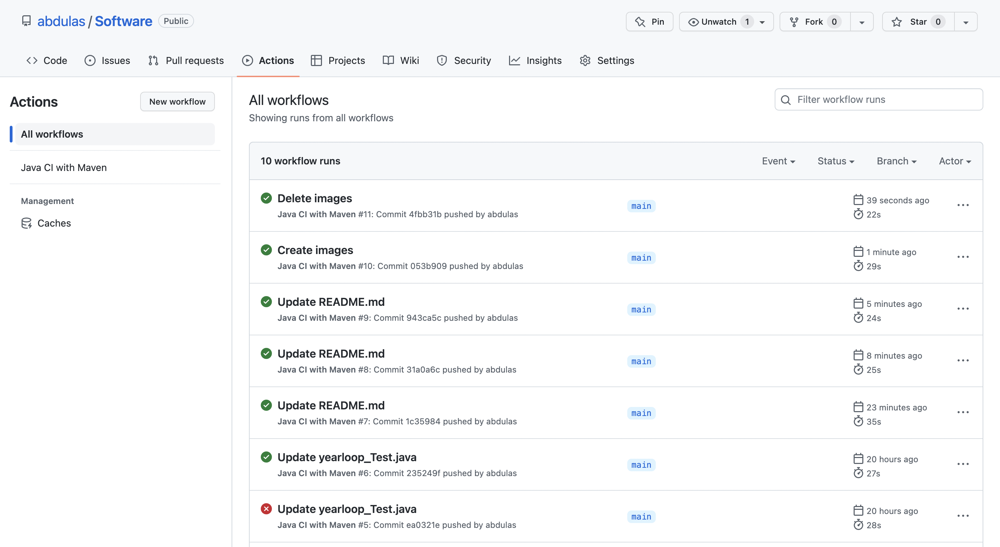

# Skriv en kort forklaring av hva du har gjort og legg som README.md på rota av repositoryet
## Det som blen gjort er:
* Jeg har logget meg inn på github
* Har lastet opp oppgave 2 i en repository som hetter Sofware, og lagde en README.md fil.
* Etter det så har jeg brukt Java with Maven By GitHub Actions.
  * Har endret lit på maven.yml Java-version.
## Sjekk at Actions-tabben viser kjøring av testene og at de passerer
#### Etter det så gikk jeg til Actions og testet Oppgave 2.
* Jeg testet om testen virker gjnnom å endre på testen i oppgave 2.
  * Etter å ha endret testen på oppgave 2, så feilet testene. har fikset testene igjen og så ble det grønt, som betyr at testene virker som det skal.

### Bilde om Actions loggen.

 
